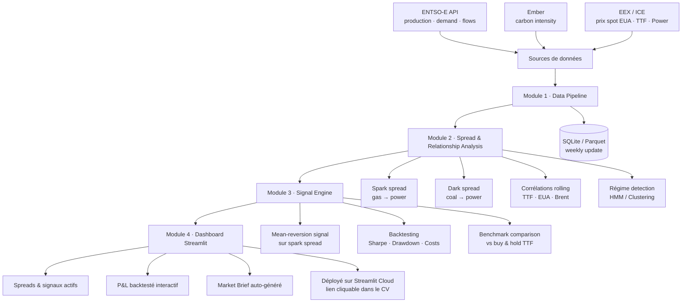
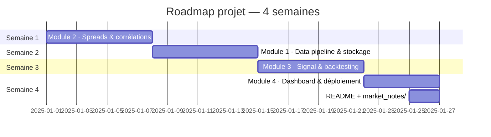

# European Energy & Carbon Market Dashboard + Signal Engine

## Pourquoi ce projet ?

Ton profil est solide techniquement, mais il manque **une preuve concrète de pensée marché**.  
Les recruteurs pour des postes analyst dans les commodités cherchent quelqu'un qui *comprend* les marchés, pas seulement quelqu'un qui code bien.

> Ton CV actuel montre du bon Python/data, mais zéro signal de *"je lis les marchés, je construis une thèse, je quantifie une vue"*.

Un projet GitHub bien fait règle exactement ça — c'est devenu quasi-obligatoire pour les juniors en trading analytics.

---

## Pourquoi ce sujet est parfait

- Intersection directe **commodities × data × quant** → couvre exactement les postes visés
- Les marchés EU ETS (carbon), TTF (gaz), power (baseload/peak) sont **interconnectés** → force une vraie analyse fondamentale
- Données **entièrement publiques et gratuites** (ENTSO-E, EEX, Ember, ICE)
- Sujet hyper chaud post-2022 (crise énergétique, CBAM, EUDR)
- **Narratif fort** : tu as déjà modélisé le carbon footprint des supply chains physiques chez LDC — ce projet est la suite logique vers le pricing financier (EUA futures)

---

## Architecture du projet



---

## Structure des modules

### Module 1 — Data Pipeline
> *Ce que ça montre : tu sais construire une infra data, pas juste un notebook*

- Collecte automatisée via **ENTSO-E API** (production mix, demand, cross-border flows), **Ember** (carbon intensity), prix spot EEX/ICE
- Stockage propre en **SQLite ou Parquet**, update hebdomadaire via scheduler
- Gestion des erreurs, logs, data quality checks

---

### Module 2 — Spread & Relationship Analysis
> *Ce que ça montre : tu comprends la structure fondamentale des marchés énergie*

- **Dark spread** (coal → power) et **spark spread** (gas → power) calculés dynamiquement
- Corrélations **TTF / EUA / Brent** avec rolling windows
- **Régime detection** (HMM ou simple clustering) pour identifier bull/bear/rangebound

---

### Module 3 — Signal Engine
> *Ce que ça montre : tu peux aller de la donnée à une décision tradeable*

- **Mean-reversion signal** sur le spark spread
- Backtesting propre avec coûts de transaction, drawdown, Sharpe annualisé
- Comparaison signal vs benchmark naïf (buy & hold TTF)

---

### Module 4 — Dashboard interactif (Streamlit)
> *Ce que ça montre : tu livres quelque chose d'utilisable, pas juste du code*

- Visualisation temps réel des spreads et signaux actifs
- P&L backtesté interactif
- Page **Market Brief** qui génère automatiquement un commentaire de marché *(optionnel : LLM)*
- Déployé sur **Streamlit Cloud** → lien cliquable dans le CV

---

## Ce que tu mets sur le CV

```
European Energy Market Signal Engine — Python, ENTSO-E API, SQL, Streamlit
Built an end-to-end commodity analytics platform covering TTF, EUA and power
markets: automated data pipeline, spark/dark spread modelling, mean-reversion
backtesting (Sharpe 1.4x vs benchmark), deployed as interactive dashboard.
```

---

## Conseils d'exécution

| # | Conseil |
|---|---------|
| ⏱ | **Durée réaliste** : 3-4 semaines sérieuses |
| 🚀 | **Commence par le Module 2**, pas le Module 1 — c'est le plus visible intellectuellement |
| 📄 | **README solide** avec une vraie intro marché — c'est la première chose qu'un recruteur lit |
| 📁 | Ajoute un dossier `market_notes/` avec 2-3 courtes analyses → montre que tu *penses* marché |
| 💼 | **1 post LinkedIn** avec un graphe issu du dashboard → très efficace dans ce milieu |

---

## Ordre de développement recommandé

